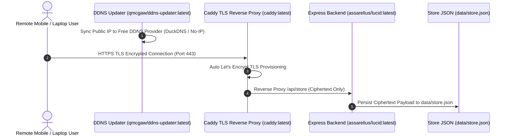

<div align="center">
  
  <h1>LucID</h1>
  <p><strong>Ultra-lightweight Self-Hosted & Open-Source Note Application featuring Client-Side AES-256-GCM End-to-End Encryption (E2EE), Native Markdown Formatting, and Zero Subscriptions.</strong></p>

  [](LICENSE)
  [](https://hub.docker.com/r/assarelius/lucid)
  [](https://github.com/Arelius-D/LucID/pkgs/container/lucid)
  [](#security--architecture)
</div>

---

## ⚡ 1-Line Instant Installation

Run this single command on your Linux Host, Server, or VPS to instantly audit ports, configure firewall, set up DuckDNS, and launch LucID inside a clean `~/lucid` directory:

```bash
curl -fsSL https://raw.githubusercontent.com/Arelius-D/LucID/main/install.sh | bash
```

To completely uninstall and wipe all containers, images, volumes, and state:

```bash
./install.sh --purge
```

---

## 🐳 Prerequisites (Docker Setup)

LucID requires Docker & Docker Compose. If your Host, Server, or VPS does not have Docker installed yet, you can automatically install Docker & Docker Compose using [NeXdocMan](https://github.com/Arelius-D/NeXdocMan):

```bash
curl -fsSL https://raw.githubusercontent.com/Arelius-D/NeXdocMan/main/nexdocman.sh | sudo bash -s -- -i -y
```

---

## Quick Onboarding Guide: Free Remote Access (DuckDNS)

To access LucID remotely from anywhere in the world over valid HTTPS without buying a domain:

### Step 1: Create a Free Account & Domain on DuckDNS
1. Go to [duckdns.org](https://www.duckdns.org) and sign in with GitHub or Google.
2. Under **subdomain**, type a name for your host (e.g. `lucid-selfhosted`) and click **add domain**.
   - Your free domain is: **`lucid-selfhosted.duckdns.org`**
3. Copy your **token** from the top of the DuckDNS dashboard.

### Step 2: Run the Automated Installer
Paste the 1-line installer on your host machine / VPS terminal:
```bash
curl -fsSL https://raw.githubusercontent.com/Arelius-D/LucID/main/install.sh | bash
```
- Enter `y` when prompted for DuckDNS.
- Enter your domain (`lucid-selfhosted.duckdns.org`) and token.
- The installer automatically detects your public IP and configures `ddns-updater` to keep DuckDNS synced automatically.

### Step 3: Open LucID in Your Browser
Open **`https://lucid-selfhosted.duckdns.org`** on your mobile phone or laptop. Set your master passphrase and start writing encrypted notes!

---

## Why LucID Exists

Most note applications force a tradeoff between data privacy and seamless access:
- **Cloud Note Services**: Store your unencrypted notes on third-party servers, creating data privacy and lock-in risks.
- **Local Markdown Files**: Require desktop software, complex sync plugins, and lack built-in web access on mobile devices.

LucID resolves this by placing cryptography directly inside your browser. All notes, titles, and tags are encrypted using client-side **AES-256-GCM** keys derived via **PBKDF2** (100,000 iterations). Your server stores exclusively encrypted Base64 payloads—it never sees your master passphrase or unencrypted notes.

---

## Key Features

- **Built-in Client-Side E2EE**: Native Web Crypto API (`crypto.subtle`) encrypts data locally before network transmission.
- **Automated Dynamic DNS Stack (`qmcgaw/ddns-updater:latest`)**: Automated DDNS IP syncing for free domains (DuckDNS, No-IP, Cloudflare) with zero-touch Caddy TLS provisioning.
- **Native Markdown Formatting**: Full support for code blocks, tables, task lists (`- [ ]`), blockquotes, and GitHub-style alerts.
- **Dual Split Views**: Toggle between Side-by-Side (Left/Right) and Top-Bottom editor split layouts.
- **Explorer Tags & Folders**: Organized hierarchy with instant fuzzy search across notes and tags.
- **Dual Visual Themes**: Dusk Ember (Dark) and Warm Linen (Light) curated themes.
- **Ultra-Lightweight Footprint**: Node.js Alpine base image utilizing minimal RAM resources.

---

## Security & Architecture



---

## Existing Reverse Proxy Setup (Caddy / Subpath Route)

If you already operate your own host Caddy reverse proxy:

```caddyfile
yourdomain.com {
    redir /lucid /lucid/ 308
    handle /lucid/* {
        uri strip_prefix /lucid
        reverse_proxy 127.0.0.1:24002
    }
}
```

---

## Deployment Options

### Option 1: Automated Setup Script

```bash
curl -fsSL https://raw.githubusercontent.com/Arelius-D/LucID/main/install.sh | bash
```

---

### Option 2: Docker Compose (App + Caddy HTTPS + DDNS Updater)

LucID includes `caddy:latest` and `qmcgaw/ddns-updater:latest` sidecars in its default `docker-compose.yml`:

```yaml
services:
  app:
    image: assarelius/lucid:latest
    container_name: lucid-app
    restart: unless-stopped
    ports:
      - "24002:3000"
    volumes:
      - ./data:/app/data

  caddy:
    image: caddy:latest
    container_name: lucid-caddy
    restart: unless-stopped
    ports:
      - "80:80"
      - "443:443"
    environment:
      - DOMAIN_NAME=${DOMAIN_NAME:-localhost}
    volumes:
      - ./Caddyfile:/etc/caddy/Caddyfile
      - caddy_data:/data
      - caddy_config:/config
    depends_on:
      - app

  ddns-updater:
    image: qmcgaw/ddns-updater:latest
    container_name: lucid-ddns
    restart: unless-stopped
    ports:
      - "8000:8000"
    volumes:
      - ./ddns-data:/updater/data

volumes:
  caddy_data:
  caddy_config:
```

---

### Option 3: Docker CLI (`docker run`)

```bash
docker run -d \
  --name lucid \
  -p 24002:3000 \
  -v $(pwd)/data:/app/data \
  --restart unless-stopped \
  assarelius/lucid:latest
```

---

### Option 4: Manual Node.js Installation

```bash
git clone https://github.com/Arelius-D/LucID.git
cd LucID
npm install --only=production
npm start
```

---

## License

Distributed under the MIT License. See [`LICENSE`](LICENSE) for more information.
