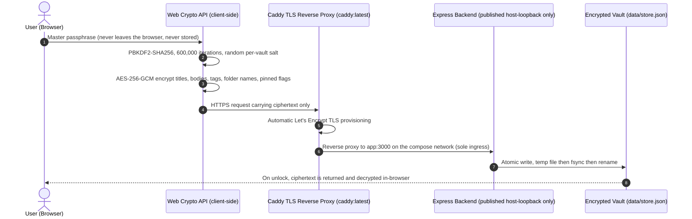

<div align="center">
  
  <h1>LucID</h1>
  <p><strong>Ultra-lightweight, self-hosted, open-source note application with client-side AES-256-GCM end-to-end encryption, native Markdown, and zero subscriptions.</strong></p>

  [](LICENSE)
  [](https://hub.docker.com/r/assarelius/lucid)
  [](https://github.com/Arelius-D/LucID/pkgs/container/lucid)
  [](#security--architecture)
</div>

---

## 1-Line Instant Installation

Run this single command on your Linux host, server, or VPS to audit ports, configure UFW rules, integrate your DuckDNS domain, and launch LucID inside a clean `~/lucid` directory:

```bash
curl -fsSL https://raw.githubusercontent.com/Arelius-D/LucID/main/install.sh | bash
```

### Choosing a channel

The installer defaults to the stable release. You can pick which branch to deploy, and the container image tag follows the branch automatically:

| Command | Deployment files from | Container image |
| :--- | :--- | :--- |
| `install.sh` | `main` | `assarelius/lucid:latest` |
| `install.sh --dev` | `dev` | `assarelius/lucid:dev` |
| `install.sh --branch NAME` | `NAME` | `assarelius/lucid:NAME` |

To install the development channel in one line, fetch the installer from the same branch you intend to deploy:

```bash
curl -fsSL https://raw.githubusercontent.com/Arelius-D/LucID/dev/install.sh | bash -s -- --dev
```

The installer script itself is versioned per branch, so pulling it from `main` and passing `--dev` will not work if `main` carries an older installer that does not recognise the flag.

This matters because `docker-compose.yml` and `Caddyfile` are fetched from the same branch as the image. Mixing a `dev` image with `main`'s compose file can leave you running new application code against old deployment settings.

> **The dev channel is untested pre-release code.** It may contain breaking changes to the vault format, and no migration path is guaranteed between dev builds. Use `main` unless you intend to test.

### Uninstalling

To completely remove all containers, images, volumes, firewall rules, and saved data:

```bash
./install.sh --purge
```

`--purge` removes whichever image tag you installed, so it works the same on either channel.

> **Warning:** `--purge` permanently deletes your encrypted note database at `data/store.json`. Because the vault is end-to-end encrypted, there is no way to recover it afterwards. Copy `data/store.json` elsewhere first if you want to keep it.

Run `install.sh --help` for the full option list.

> **Note:** Database CLI export, import, and backup management utilities will be introduced in an upcoming release.

---

## Prerequisites (Docker Setup)

LucID requires Docker and Docker Compose. If your host does not have Docker installed yet, you can install both automatically using [NeXdocMan](https://github.com/Arelius-D/NeXdocMan):

```bash
curl -fsSL https://raw.githubusercontent.com/Arelius-D/NeXdocMan/main/nexdocman.sh | sudo bash -s -- -i -y
```

---

## Quick Onboarding Guide: Free Remote Access (DuckDNS)

To reach LucID from anywhere over valid HTTPS without buying a domain:

### Step 1: Create a free account and domain on DuckDNS

1. Go to [duckdns.org](https://www.duckdns.org) and sign in with GitHub or Google.
2. Under **subdomain**, type a name for your host (for example `your-subdomain`) and click **add domain**. Your domain becomes `your-subdomain.duckdns.org`.
3. Copy your **token** from the top of the DuckDNS dashboard.

### Step 2: Run the automated installer

```bash
curl -fsSL https://raw.githubusercontent.com/Arelius-D/LucID/main/install.sh | bash
```

For the development channel, fetch the installer from the `dev` branch instead and append `-s -- --dev`.

Enter `y` when prompted for DuckDNS, then supply your domain and token. The installer detects your public IP and configures `ddns-updater` to keep DuckDNS synced automatically.

### Step 3: Open LucID in your browser

Open `https://your-subdomain.duckdns.org`, set your master passphrase, and start writing.

> **HTTPS is required.** The browser's Web Crypto API is only available in a secure context. Served over plain HTTP to a bare IP address, encryption is unavailable and LucID will refuse to unlock. Always access LucID through the bundled Caddy reverse proxy or your own TLS setup.

---

## Why LucID Exists

LucID is 100% free and open-source, with no subscription paywalls, no feature tiers, and no locked capabilities.

Most note applications force a tradeoff between data privacy and remote access:

- **Cloud note services** store your unencrypted notes on third-party servers, creating privacy and vendor lock-in risks.
- **Local markdown editors** lack browser access from other machines without complex sync plugins or paid subscriptions.

LucID combines zero-trust client cryptography with transport-layer security:

- **Zero-trust data at rest.** Note titles, note contents, tags, folder names, and pinned states are all encrypted inside your browser using AES-256-GCM, with keys derived via PBKDF2-HMAC-SHA256 at 600,000 iterations using a random per-vault salt. The server receives only ciphertext. It never sees your master passphrase or any readable content.
- **In-transit protection.** TLS over HTTPS encrypts every exchange on the network, on top of the payload encryption already applied in the browser.

---

## Key Features

- **100% free and open source.** No paid tiers, no locked features, no tracking, no telemetry.
- **Client-side E2EE.** Native Web Crypto API (`crypto.subtle`) encrypts your data locally before anything is transmitted.
- **Eight standalone OKLCH themes.** Dusk Ember (dark), Amber Hour (twilight), Warm Linen (light), Dracula, and four Catppuccin palette flavors (Latte, Frappé, Macchiato, Mocha) grouped in a flyout menu with theme-adaptive scrollbars.
- **Four locally-served font sets.** Geist + Geist Mono (default), IBM Plex Sans, Source Sans 3, and Inter + JetBrains Mono served from host origin — zero external CDN requests.
- **Full-text decrypted search.** Typing searches note titles, tags, and decrypted note contents simultaneously, with a flat-list dedicated search view.
- **Print & PDF export.** Integrated print button renders note preview into a clean, un-styled printable layout for native browser Save-as-PDF without app chrome.
- **Markdown & batch ZIP export.** Single-note `.md` Markdown download with UTF-8 BOM and zero-dependency folder batch `.zip` export.
- **Focus mode.** True fullscreen view hiding OS/browser chrome and side panels for distraction-free writing.
- **Trash can recovery.** Soft-deletion for notes and folders with read-only trashed preview, drag-and-drop restore, or manual empty trash.
- **Tag library & picker.** Vault-level tag library with toggleable tag picker menu for single or multi-tag assignment without typos.
- **Note pinning.** Pin notes to a dedicated third explorer view alongside Folders and Tags.
- **Code block copy button.** Hover copy control on fenced code blocks in preview with instant tick feedback.
- **E2EE posture & idle auto-lock.** Dynamic lock glyph reporting auto-lock posture (keyhole armed, shield off/60-min floor, X eviction warning) with configurable timeouts (off, 5, 15, or 30 minutes).
- **Automated dynamic DNS stack.** Integrates [DDNS Updater](https://github.com/qdm12/ddns-updater) for free domain IP syncing, with zero-touch [Caddy](https://github.com/caddyserver/caddy) Let's Encrypt TLS.
- **Native Markdown.** Full support for code blocks with syntax highlighting, task lists, tables, and blockquotes.
- **Dual split views.** Toggle between side-by-side and top-bottom editor layouts.

---

## Empirical Production System Footprint

Measured on the live production host (Ubuntu 26.04 LTS) by sampling the running stack every 5 seconds for 20 minutes — **240 samples**. Values are run averages with observed peaks, not a single-moment snapshot.

**These are at-rest figures.** No browser session was open and no notes were read or written for the duration of the run, so the stack is doing what a self-hosted notes app does for the overwhelming majority of its uptime: sitting deployed, holding a TLS certificate, keeping a DNS record current, and waiting. That is the number that matters for a service you leave running on a VPS or a home server all year. Encryption and decryption happen in your browser, not on the server, so opening a vault costs your device CPU and costs the host almost nothing beyond serving a few static files.

### 1. Active Container Memory & CPU Usage

| Component | Avg CPU % | Peak CPU % | Avg cgroup RAM | Peak cgroup RAM | Host Process RSS RAM | Status |
| :--- | :--- | :--- | :--- | :--- | :--- | :--- |
| Application Backend (`assarelius/lucid:latest`) | **0.00%** | **0.00%** | **14.10 MiB** | **15.19 MiB** | **65.02 MB** | `Up (healthy)` |
| Caddy Reverse Proxy (`caddy:latest`) | **0.00%** | **0.12%** | **11.68 MiB** | **12.15 MiB** | **47.35 MB** | `Up` (no healthcheck) |
| Dynamic DNS Updater (`qmcgaw/ddns-updater:latest`) | **0.11%** | **5.51%** | **5.48 MiB** | **8.81 MiB** | **16.44 MB** | `Up (healthy)` |
| **Total Active Container Stack** | **0.11%** | — | **31.26 MiB** | — | **128.81 MB** | **All Running** |

The application backend registered **0.00% CPU across every one of the 240 samples**, at rest and while serving.

> Caddy carries no healthcheck deliberately. An HTTP probe against port 80 follows Caddy's automatic HTTPS redirect and then fails the TLS handshake against localhost, reporting `unhealthy` while Caddy is serving correctly, and the admin endpoint that would give a clean probe is switched off. See `SECURITY.md`.

### 2. Infrastructure Overhead

| Process / Daemon | Avg Host RSS | Peak Host RSS | Role |
| :--- | :--- | :--- | :--- |
| `dockerd` | **102.57 MB** | 106.76 MB | Docker Engine System Daemon |
| `containerd` | **45.13 MB** | 48.87 MB | Container Runtime Daemon |
| `containerd-shim-runc-v2` | **35.39 MB** | 36.31 MB | Container Process Shims (one per container) |
| `docker-proxy` | **31.12 MB** | 31.12 MB | Network Port Forwarding Proxy |
| **Total Infrastructure Overhead** | **214.21 MB** | — | Docker Engine Baseline |

**Grand total, application stack plus Docker engine: 343.02 MB Host RSS.**

> `containerd` counts only the daemon itself. Matching on a `/usr/bin/containerd` command-line substring also catches every `containerd-shim-runc-v2` process, folding the shims into the daemon figure and double-counting them against the row below.

### 3. Disk Footprint Breakdown

| Asset | Size | Category |
| :--- | :--- | :--- |
| Application Deployment Directory | **60 KB** | Configuration & Local Storage |
| Application Container Image (`assarelius/lucid:latest`) | **254 MB** on disk, **63.5 MB** compressed | Docker Container Image |
| Caddy Reverse Proxy Image (`caddy:latest`) | **88.7 MB** on disk, **24.3 MB** compressed | Docker Container Image |
| Dynamic DNS Updater Image (`qmcgaw/ddns-updater:latest`) | **19.4 MB** on disk, **5.55 MB** compressed | Docker Container Image |
| TLS Certificate & ACME Config Cache (`lucid_caddy_data`, `lucid_caddy_config`) | **6.47 KB** | Named Docker Volumes |
| Container Writable Layers (3 × 4.1 kB) | **12.3 KB** | Overlay2 Diff Layers |
| Build Cache | **0 B** | Docker Build Cache |

---

## Security & Architecture

The encryption boundary is your browser. Everything you author is encrypted client-side before it reaches the network, so the server, the reverse proxy, and anyone with filesystem access only ever see ciphertext. The server is deliberately simple: it stores an opaque blob and has no means to read it.

### Encryption flow



### What is encrypted

| Stored on the server | State |
| :--- | :--- |
| Note titles | Encrypted (AES-256-GCM) |
| Note contents | Encrypted (AES-256-GCM) |
| Tags | Encrypted (AES-256-GCM) |
| Folder names | Encrypted (AES-256-GCM) |
| Pinned flags | Encrypted (AES-256-GCM) |
| Master passphrase | Never transmitted and never stored, anywhere |
| Record IDs and timestamps | Plaintext. Randomly generated or timestamp-derived, so they describe nothing |
| KDF parameters (salt, iterations) | Plaintext by design. A salt is not a secret and must be readable to derive your key |

### Key derivation

Your key is derived with PBKDF2-HMAC-SHA256 at 600,000 iterations, using a random 16-byte salt generated uniquely for your vault and stored inside it. Because the salt is per-vault, the same passphrase produces a different key on every installation, so one precomputed table cannot be reused against multiple vaults. The derived key is non-extractable: the browser will not surrender its raw bytes to any script, including LucID's own.

### Session handling

While unlocked, the non-extractable key is held in IndexedDB and gated by a per-tab session token. The passphrase itself is never persisted in any form. Locking the vault, or the idle auto-lock firing, destroys both.

### Hardening

- Rendered Markdown is sanitised with DOMPurify before display, and a strict Content-Security-Policy (`script-src 'self'`) blocks inline execution, so note content can never run code that could reach your key.
- No third-party CDNs. All runtime libraries are vendored and version-pinned, so no external host can inject code into the app origin.
- Same-origin writes only. The API rejects cross-origin writes, and services bind to loopback so Caddy is the only route in.
- Writes are atomic. The vault is written to a temporary file, fsynced, then renamed, so an interrupted write cannot truncate it. A vault file that cannot be parsed is preserved rather than replaced.

> **Recovery:** there is no backdoor and no reset. If you lose your master passphrase your notes are unrecoverable. That is the direct consequence of true zero-knowledge encryption.

> **Note:** LucID's cryptography has not been independently audited. See [SECURITY.md](SECURITY.md) for the full threat model and for how to report a vulnerability.

---

## Dependencies

> This section states the maintainer's dependency policy. Draft wording, to be finalised.

LucID deliberately runs on a very small dependency surface: two runtime packages on the server, and 11 vendored browser packages (3 runtime libraries and 8 font packages across 4 font sets). Everything else is written in-house.

**Policy: always prefer the latest version.** An out-of-date dependency is treated as a standing vulnerability. When a new version ships it is usually because a bug, an issue, or a security flaw was fixed, and staying behind means knowingly serving that flaw to users. Major versions are therefore not held back. If a major upgrade breaks the build, that breakage is caught by CI and fixed. A broken build is a problem for the maintainer. An outdated dependency is a problem for every user.

**Runtime (server):**

| Package | Purpose |
| :--- | :--- |
| `express` | HTTP server and static file serving |
| `cors` | Cross-origin policy, disabled by default and opt-in via `CORS_ORIGIN` |

**Vendored (browser):** these are served from your own host, never from a CDN, so no third party can observe your traffic or inject code.

| Library | Purpose |
| :--- | :--- |
| `dompurify` | Sanitises rendered Markdown before it reaches the DOM |
| `marked` | Markdown parsing |
| `@highlightjs/cdn-assets` | Syntax highlighting for code blocks and its themes |
| `@fontsource/*` (8 packages) | The four user-selectable UI/editor font sets, served from your origin |

**How the policy is enforced:**

- **Dependabot runs daily** against npm packages, the Docker base image, and the GitHub Actions used by the build. Major version updates are not ignored.
- **The build fails on known vulnerabilities.** CI runs `npm audit --audit-level=high` and will not publish an image that carries one.
- **Vendored libraries cannot silently rot.** They are declared as devDependencies so that `npm audit` and Dependabot track them, and are copied into `public/vendor/` by `npm run vendor`. CI fails the build if the vendored files have drifted from the declared versions.
- **`package-lock.json` pins exact versions** so any given build is reproducible. Dependabot moves those pins forward. The build is reproducible and current, rather than reproducible and frozen.

---

## Existing Reverse Proxy Setup (Caddy Subpath Route)

If you already operate your own host Caddy reverse proxy:

```caddyfile
yourdomain.com {
    redir /lucid /lucid/ 308
    handle /lucid/* {
        uri strip_prefix /lucid
        reverse_proxy 127.0.0.1:58243
    }
}
```

---

## Deployment Options

### Option 1: Automated setup script

```bash
curl -fsSL https://raw.githubusercontent.com/Arelius-D/LucID/main/install.sh | bash
```

For a non-stable channel, fetch the installer from that branch and pass the matching flag, for example `.../dev/install.sh | bash -s -- --dev`. See [Choosing a channel](#choosing-a-channel).

---

### Option 2: Docker Compose (app, Caddy HTTPS, DDNS updater)

LucID ships [Caddy](https://github.com/caddyserver/caddy) and [DDNS Updater](https://github.com/qdm12/ddns-updater) by [@qmcgaw](https://github.com/qmcgaw) as sidecars in its default `docker-compose.yml`:

```yaml
services:
  app:
    image: assarelius/lucid:latest
    container_name: lucid-app
    restart: unless-stopped
    user: "${LUCID_UID:-1000}:${LUCID_GID:-1000}"
    ports:
      - "127.0.0.1:58243:3000"
    volumes:
      - ./data:/app/data

  caddy:
    image: caddy:latest
    container_name: lucid-caddy
    restart: unless-stopped
    ports:
      - "80:80"
      - "443:443"
    environment:
      - DOMAIN_NAME=${DOMAIN_NAME:-localhost}
    volumes:
      - ./Caddyfile:/etc/caddy/Caddyfile
      - caddy_data:/data
      - caddy_config:/config
    depends_on:
      - app

  ddns-updater:
    image: qmcgaw/ddns-updater:latest
    container_name: lucid-ddns
    restart: unless-stopped
    ports:
      - "127.0.0.1:8000:8000"
    volumes:
      - ./ddns-data:/updater/data

volumes:
  caddy_data:
  caddy_config:
```

---

### Option 3: Docker CLI

```bash
docker run -d \
  --name lucid \
  -p 127.0.0.1:58243:3000 \
  -v $(pwd)/data:/app/data \
  --restart unless-stopped \
  assarelius/lucid:latest
```

Bound to loopback so the unauthenticated API is not exposed. Put a TLS reverse proxy in front of it, and remember that Web Crypto requires HTTPS.

---

### Option 4: Manual Node.js installation

```bash
git clone https://github.com/Arelius-D/LucID.git
cd LucID
npm ci --omit=dev
npm start
```

Set `DATA_DIR` to keep the vault outside the repository, for example `DATA_DIR=/var/lib/lucid npm start`.

---

## Configuration

| Variable | Default | Purpose |
| :--- | :--- | :--- |
| `PORT` | `3000` | Port the server listens on |
| `DATA_DIR` | `./data` | Where the encrypted vault is stored |
| `CORS_ORIGIN` | unset | Comma-separated origins allowed to call the API. Leave unset unless you deliberately serve the UI from a different origin |
| `VERSION` | package version | Overrides the version reported at `/api/version` |

---

## Roadmap & Release Milestones

### Phase 1: Core E2EE stack and infrastructure (completed)

- [x] Client-side AES-256-GCM end-to-end encryption.
- [x] Full OKLCH tokenised design system with rem sizing, WCAG contrast compliance, and no `!important` hacks.
- [x] Idle auto-lock engine, soft timeout of off, 5, 15, or 30 minutes plus a 60-minute hard ceiling.
- [x] Lock screen UX with show/hide passphrase reveal, live Caps Lock detection, and a vault-locked status cue.
- [x] UI state persistence: tree open and collapse state saved across sessions, default top-bottom split view.
- [x] Symmetrical panel toggles, right inspector collapse and expand mirrors the left sidebar.
- [x] Real-time passphrase match validation with prefix-aware mismatch detection.
- [x] GitHub version and update indicator in the sidebar footer.
- [x] Automated dynamic DNS stack integration.
- [x] Zero-touch Let's Encrypt TLS reverse proxy.
- [x] Zero-touch automated installer and complete purge teardown utility.

### Phase 2: Security hardening, vault format v2 & feature evolution (completed in 2.0.0 – 2.7.0)

- [x] Full-vault encryption (titles, bodies, tags, folder names, pinned flags encrypted client-side).
- [x] Random per-vault PBKDF2 salt (600,000 iterations), non-extractable CryptoKey in IndexedDB (`v2.0.0`).
- [x] Rendered Markdown sanitised with DOMPurify, backed by a strict Content-Security-Policy (`v2.0.0`).
- [x] Note Pinning and dedicated Pinned Explorer view (`v2.1.0`).
- [x] Trash can soft-deletion, read-only trashed preview, and drag-and-drop restore (`v2.2.0`).
- [x] Four locally-served font sets (Geist, IBM Plex, Source, Inter+JetBrains Mono) with in-app picker (`v2.2.0`).
- [x] Amber Hour twilight theme & footer theme picker menu (`v2.3.0`).
- [x] License changed to AGPL-3.0-only (`v2.3.0`).
- [x] Vault-level tag library and single-click tag assignment picker menu (`v2.4.0`).
- [x] Lock screen UX refactor with inline Caps Lock detection & heartbeat server-unreachable mode (`v2.5.0`).
- [x] Print note preview / browser Save-as-PDF engine (`v2.6.0`).
- [x] Full-text search across decrypted note bodies with flat-list search view (`v2.6.0`).
- [x] Focus Mode true fullscreen view (`v2.6.0`).
- [x] Copy-to-clipboard button on fenced code blocks (`v2.6.0`).
- [x] Dynamic auto-lock posture indicator (keyhole / shield / X eviction warning) (`v2.6.0`).
- [x] 8 Standalone OKLCH themes including Dracula & Catppuccin palette (Latte, Frappé, Macchiato, Mocha) (`v2.7.0`).

### Phase 3: Export and vault backup mechanics (in progress)

- [x] **PDF export.** In-browser print engine and formatted PDF generator (`v2.6.0`).
- [x] **UTF-8 BOM Markdown & batch ZIP export.** Single note `.md` download with UTF-8 BOM and zero-dependency folder batch `.zip` export (`v2.8.0`).
- [ ] **Encrypted vault backup and restore (`.lucid`).** Export full encrypted vault backups for personal cloud storage such as Nextcloud, S3, Dropbox, or a NAS, with in-browser restore.

### Phase 4: Host CLI management tool (upcoming)

- [ ] **Host CLI utility.** Python or Bash tool for passphrase validation, database health inspection, and headless automated backups directly on your server.

---

## Contributing & Collaboration

Collaborations, bug fixes, and feature enhancements are welcome.

- **Report bugs** on [GitHub Issues](https://github.com/Arelius-D/LucID/issues).
- **Ask questions or share feedback** in [GitHub Discussions](https://github.com/Arelius-D/LucID/discussions).
- **Submit improvements** via [Pull Requests](https://github.com/Arelius-D/LucID/pulls).
- **Report a security vulnerability privately.** Do not open a public issue. See [SECURITY.md](SECURITY.md).

---

## Support & Sponsorship

Any form of contribution or donation is appreciated. [Sponsor here](https://github.com/sponsors/Arelius-D).

---

## Acknowledgments

LucID is built on excellent open-source work:

- [Node.js](https://nodejs.org/) and [Express](https://github.com/expressjs/express) for the server runtime and HTTP layer.
- [DOMPurify](https://github.com/cure53/DOMPurify) by [Cure53](https://cure53.de/) for HTML sanitisation.
- [marked](https://github.com/markedjs/marked) for Markdown parsing.
- [highlight.js](https://github.com/highlightjs/highlight.js) for syntax highlighting.
- [Blade Iconsax](https://github.com/saade/blade-iconsax) by [@saade](https://github.com/saade) for the Iconsax Linear vector UI icons.
- [Caddy](https://github.com/caddyserver/caddy) for zero-touch Let's Encrypt TLS provisioning.
- [DDNS Updater](https://github.com/qdm12/ddns-updater) by [@qmcgaw](https://github.com/qmcgaw) for automated multi-provider dynamic DNS syncing.

DOMPurify, marked, and highlight.js are vendored into `public/vendor/` and served from your own host rather than a CDN.

---

## License

Distributed under the GNU Affero General Public License v3.0. Run it, self-host it, modify it freely — but if you offer a modified LucID to others over a network, you must publish your modifications under the same license. See [`LICENSE`](LICENSE) for the full text. Releases up to and including v2.2.0 were published under MIT and remain so.

License compliance of every dependency is continuously verified by FOSSA on each push:

[](https://app.fossa.com/projects/custom%2B63625%2Fgithub.com%2FArelius-D%2FLucID?ref=badge_large&issueType=license)
