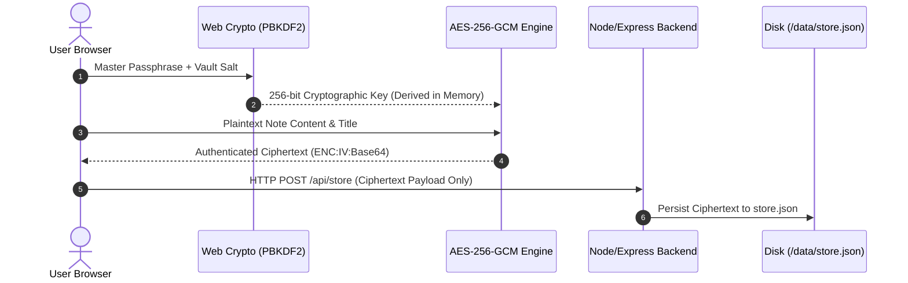

<div align="center">
  
  <h1>LucID</h1>
  <p><strong>Ultra-lightweight Self-Hosted & Open-Source Note Application featuring Client-Side AES-256-GCM End-to-End Encryption (E2EE), Native Markdown Formatting, and Zero Subscriptions.</strong></p>

  [](LICENSE)
  [](https://hub.docker.com/r/assarelius/lucid)
  [](https://github.com/Arelius-D/LucID/pkgs/container/lucid)
  [](#security--architecture)
</div>

---

## Why LucID Exists

LucID is a privacy-first, self-hosted note application built for speed and complete data ownership. Client-side AES-256-GCM encryption ensures your master passphrase is never stored on disk or transmitted across the network. Most commercial and open-source note tools eventually lock features behind subscriptions. LucID is different: it is 100% free, fully open-source, and will never have paywalled features.

---

## Key Features

- **Client-Side End-to-End Encryption (E2EE)**: Powered by native Web Crypto API using AES-256-GCM and PBKDF2 key derivation (100,000 iterations). All titles, contents, and tags are encrypted locally in your browser.
- **Native Markdown & Live Preview**: Full GFM Markdown support with syntax highlighting for code blocks, task lists, tables, and synchronized live rendering.
- **Dual Split View Layout**: Switch between Side-by-Side (Left/Right) and Top-Bottom split views with draggable pane resizing.
- **Organization & Expandable Tags**: Dual explorer supporting nested folder trees and expandable tag views with context menus.
- **Dusk Ember & Warm Linen Themes**: Includes custom metallic dark mode and warm paper light mode.
- **Micro Resource Footprint**: Built with zero heavy framework bloat, consuming under 25MB RAM and 0% CPU at idle.
- **Cross-Platform Support**: Responsive layout designed for desktop browsers and mobile web applications.

---

## Technical Stack & Container Architecture

LucID is built with a minimal, dependency-light tech stack designed for speed, security, and long-term maintainability:

| Component | Technology | Description |
| :--- | :--- | :--- |
| **Base Image** | `node:alpine` | Minimal Alpine Linux base image (~50MB footprint) |
| **Backend** | Node.js Current / Express | Fast REST API & static file provider |
| **Frontend** | Vanilla HTML5 / CSS3 / JS | Native LucID Design System (No framework overhead) |
| **Cryptography** | Web Crypto API | `crypto.subtle` PBKDF2 key derivation & AES-256-GCM |
| **Parser** | Marked.js & Highlight.js | GFM Markdown parsing & code syntax highlighting |

---

## Security & Architecture



- **Initialization Vector (IV)**: Every encryption operation generates a unique 96-bit cryptographically secure random IV via `crypto.getRandomValues`.
- **Ciphertext Storage Format**: Encrypted payloads are formatted as `ENC:iv_base64:ciphertext_base64` before transmission.
- **Backend Role**: The Node/Express server provides basic `GET /api/store` and `POST /api/store` REST endpoints to persist JSON payload blobs without reading or decrypting contents.

---

## Deployment Options

### Option 1: Docker Compose (Recommended)

Create a `docker-compose.yml` file:

```yaml
services:
  lucid:
    image: assarelius/lucid:latest
    container_name: lucid
    ports:
      - "8484:3000"
    volumes:
      - ./data:/app/data
    restart: unless-stopped
```

Start the service:
```bash
docker compose up -d
```

### Option 2: Docker CLI (`docker run`)

```bash
docker run -d \
  --name lucid \
  -p 8484:3000 \
  -v $(pwd)/data:/app/data \
  --restart unless-stopped \
  assarelius/lucid:latest
```

### Option 3: Manual Node.js Installation

Requirements: Node.js >= 20

```bash
git clone https://github.com/Arelius-D/LucID.git
cd LucID
npm install --only=production
npm start
```

Access LucID in your web browser at `http://localhost:8484` (or `http://localhost:3000` for manual Node.js).

---

## License

LucID is 100% Free and Open-Source Software licensed under the [MIT License](LICENSE).
