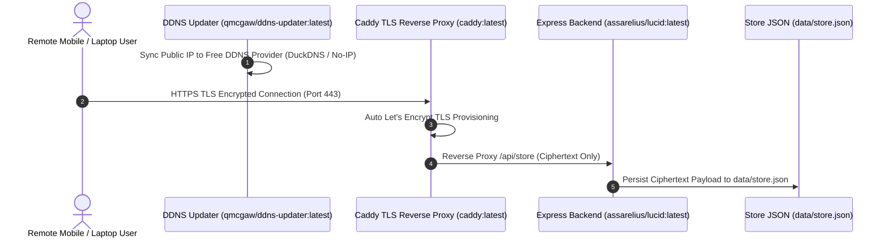

<div align="center">
  
  <h1>LucID</h1>
  <p><strong>Ultra-lightweight Self-Hosted & Open-Source Note Application featuring Client-Side AES-256-GCM End-to-End Encryption (E2EE), Native Markdown Formatting, and Zero Subscriptions.</strong></p>

  [](LICENSE)
  [](https://hub.docker.com/r/assarelius/lucid)
  [](https://github.com/Arelius-D/LucID/pkgs/container/lucid)
  [](#security--architecture)
</div>

---

## ⚡ 1-Line Instant Installation

Run this single command on your Linux Host, Server, or VPS to instantly audit ports, configure UFW rules, integrate your DuckDNS domain, and launch LucID inside a clean `~/lucid` directory:

```bash
curl -fsSL https://raw.githubusercontent.com/Arelius-D/LucID/main/install.sh | bash
```

To completely uninstall and wipe all containers, images, volumes, and saved data (⚠️ **Warning**: This permanently deletes your stored encrypted note database `data/store.json`):

```bash
./install.sh --purge
```

> **Note**: Database CLI export, import, and backup management utilities will be introduced in an upcoming release.

---

## 🐳 Prerequisites (Docker Setup)

LucID requires Docker & Docker Compose. If your Host, Server, or VPS does not have Docker installed yet, you can automatically install Docker & Docker Compose using [NeXdocMan](https://github.com/Arelius-D/NeXdocMan):

```bash
curl -fsSL https://raw.githubusercontent.com/Arelius-D/NeXdocMan/main/nexdocman.sh | sudo bash -s -- -i -y
```

---

## Quick Onboarding Guide: Free Remote Access (DuckDNS)

To access LucID remotely from anywhere in the world over valid HTTPS without buying a domain:

### Step 1: Create a Free Account & Domain on DuckDNS
1. Go to [duckdns.org](https://www.duckdns.org) and sign in with GitHub or Google to create your free account.
2. Under **subdomain**, type a name for your host (e.g. `your-subdomain`) and click **add domain**.
   - Your domain will be: **`your-subdomain.duckdns.org`**
3. Copy your **token** from the top of the DuckDNS dashboard.

### Step 2: Run the Automated Installer
Paste the 1-line installer on your host machine / VPS terminal:
```bash
curl -fsSL https://raw.githubusercontent.com/Arelius-D/LucID/main/install.sh | bash
```
- Enter `y` when prompted for DuckDNS.
- Enter your domain (`your-subdomain.duckdns.org`) and token.
- The installer automatically detects your public IP and configures `ddns-updater` to keep DuckDNS synced automatically.

### Step 3: Open LucID in Your Browser
Open **`https://your-subdomain.duckdns.org`** on your mobile phone or laptop. Set your master passphrase and start writing encrypted notes!

---

## Why LucID Exists

LucID is **100% free and open-source** with **no subscription paywalls, no feature tiers, and no locked capabilities**.

Most note applications force a tradeoff between data privacy and remote access:
- **Cloud Note Services**: Store your unencrypted notes on third-party servers, creating data privacy and vendor lock-in risks.
- **Local Markdown Editors**: Lack native browser access on mobile devices without complex sync plugins or paid subscriptions.

LucID combines zero-trust client cryptography with transport-layer security:
- **Zero-Trust Data at Rest**: All notes, titles, and tags are encrypted directly inside your browser using client-side **AES-256-GCM** keys derived via **PBKDF2** (100,000 iterations). Your server stores exclusively encrypted Base64 payloads—it never sees your master passphrase or unencrypted notes.
- **In-Transit Protection**: Transport Security over **TLS HTTPS** ensures that all data exchanges are encrypted over the network.

---

## Key Features

- **100% Free & Open Source**: No paid tiers, no locked features, no tracking.
- **Built-in Client-Side E2EE**: Native Web Crypto API (`crypto.subtle`) encrypts data locally before network transmission.
- **Automated Dynamic DNS Stack**: Integrates [DDNS Updater](https://github.com/qdm12/ddns-updater) for free domain IP syncing with zero-touch [Caddy](https://github.com/caddyserver/caddy) Let's Encrypt TLS.
- **Native Markdown Formatting**: Full support for code blocks, tables, task lists (`- [ ]`), blockquotes, and GitHub-style alerts.
- **Dual Split Views**: Toggle between Side-by-Side (Left/Right) and Top-Bottom editor split layouts.
- **Explorer Tags & Folders**: Organized hierarchy with instant fuzzy search across notes and tags.
- **Dual Visual Themes**: Dusk Ember (Dark) and Warm Linen (Light) curated themes.

---

## 📊 Empirical Production System Footprint (Measured Live on Linux Host)

Below are the exact empirical CPU, cgroup RAM, Host RSS RAM, and Disk storage metrics measured directly from a live Linux server host:

### 1. Active Container Memory & CPU Usage

| Component | CPU % | cgroup RAM | Host Process RSS RAM | Status |
| :--- | :--- | :--- | :--- | :--- |
| Application Backend (`assarelius/lucid:latest`) | **0.00%** | **18.59 MiB** | **74.71 MB** | `Up (healthy)` |
| Caddy Reverse Proxy (`caddy:latest`) | **0.00%** | **11.35 MiB** | **47.02 MB** | `Up (healthy)` |
| Dynamic DNS Updater (`qmcgaw/ddns-updater:latest`) | **0.00%** | **5.07 MiB** | **16.05 MB** | `Up (healthy)` |
| **Total Active Container Stack** | **0.00%** | **~35.01 MiB** | **~137.78 MB** | **All Healthy** |

### 2. Infrastructure Overhead

| Process / Daemon | Host Process RSS RAM | Role |
| :--- | :--- | :--- |
| `dockerd` | **101.12 MB** | Docker Engine System Daemon |
| `containerd` | **94.31 MB** | Container Runtime Daemon |
| `docker-proxy` | **42.00 MB** | Network Port Forwarding Proxy |
| `containerd-shim-runc-v2` | **34.12 MB** | Container Process Shims |

### 3. Disk Footprint Breakdown

| Asset | Size | Category |
| :--- | :--- | :--- |
| Application Deployment Directory | **36 KB** | Configuration & Local Storage |
| Application Container Image (`assarelius/lucid:latest`) | **276 MB** | Docker Container Image |
| Caddy Reverse Proxy Image (`caddy:latest`) | **88.7 MB** | Docker Container Image |
| Dynamic DNS Updater Image (`qmcgaw/ddns-updater:latest`) | **19.4 MB** | Docker Container Image |
| TLS Certificate & ACME Config Cache | **< 10 KB** | Named Docker Volumes |

---

## Security & Architecture



---

## Existing Reverse Proxy Setup (Caddy / Subpath Route)

If you already operate your own host Caddy reverse proxy:

```caddyfile
yourdomain.com {
    redir /lucid /lucid/ 308
    handle /lucid/* {
        uri strip_prefix /lucid
        reverse_proxy 127.0.0.1:58243
    }
}
```

---

## Deployment Options

### Option 1: Automated Setup Script

```bash
curl -fsSL https://raw.githubusercontent.com/Arelius-D/LucID/main/install.sh | bash
```

---

### Option 2: Docker Compose (App + Caddy HTTPS + DDNS Updater)

LucID includes [Caddy](https://github.com/caddyserver/caddy) (`caddy:latest`) and [DDNS Updater](https://github.com/qdm12/ddns-updater) by [@qmcgaw](https://github.com/qmcgaw) (`qmcgaw/ddns-updater:latest`) sidecars in its default `docker-compose.yml`:

```yaml
services:
  app:
    image: assarelius/lucid:latest
    container_name: lucid-app
    restart: unless-stopped
    ports:
      - "58243:3000"
    volumes:
      - ./data:/app/data

  caddy:
    image: caddy:latest
    container_name: lucid-caddy
    restart: unless-stopped
    ports:
      - "80:80"
      - "443:443"
    environment:
      - DOMAIN_NAME=${DOMAIN_NAME:-localhost}
    volumes:
      - ./Caddyfile:/etc/caddy/Caddyfile
      - caddy_data:/data
      - caddy_config:/config
    depends_on:
      - app

  ddns-updater:
    image: qmcgaw/ddns-updater:latest
    container_name: lucid-ddns
    restart: unless-stopped
    ports:
      - "8000:8000"
    volumes:
      - ./ddns-data:/updater/data

volumes:
  caddy_data:
  caddy_config:
```

---

### Option 3: Docker CLI (`docker run`)

```bash
docker run -d \
  --name lucid \
  -p 58243:3000 \
  -v $(pwd)/data:/app/data \
  --restart unless-stopped \
  assarelius/lucid:latest
```

---

### Option 4: Manual Node.js Installation

```bash
git clone https://github.com/Arelius-D/LucID.git
cd LucID
npm install --only=production
npm start
```

---

## Roadmap & Release Milestones

### Phase 1: Core E2EE Stack & Infrastructure (Completed)
- [x] Client-side AES-256-GCM End-to-End Encryption with PBKDF2 (100,000 iterations).
- [x] Automated Dynamic DNS stack integration ([DDNS Updater](https://github.com/qdm12/ddns-updater)).
- [x] Zero-touch Let's Encrypt TLS reverse proxy ([Caddy](https://github.com/caddyserver/caddy)).
- [x] Zero-touch automated installer & complete purge teardown utility (`./install.sh --purge`) for wiping container stack, images, volumes, data, and UFW firewall rules.

### Phase 2: Export & Vault Backup Mechanics (Upcoming)
- [ ] **UTF-8 BOM Markdown Export**: Single note download & full vault batch `.zip` export (with `EF BB BF` UTF-8 BOM header).
- [ ] **PDF Export**: In-browser print engine and formatted PDF document generator.
- [ ] **Encrypted Vault Backup & Restore (`.lucid`)**: Export full encrypted `.lucid` vault database backups for personal cloud storage (Nextcloud, S3, Dropbox, NAS) with in-browser restore.

### Phase 3: Host CLI Management Tool (Upcoming)
- [ ] **Host CLI Utility**: Python/Bash CLI tool for passphrase validation, database health inspection, and headless automated backups directly on your server.

---

## Contributing & Collaboration

Collaborations, bug fixes, and feature enhancements are warmly welcome! If you'd like to report bugs, suggest features, or collaborate on code improvements:

- 🐛 **Report Bugs**: Submit bug reports on [GitHub Issues](https://github.com/Arelius-D/LucID/issues).
- 💬 **Join Discussions**: Ask questions or share feedback in [GitHub Discussions](https://github.com/Arelius-D/LucID/discussions).
- 🔧 **Submit Improvements**: Collaborate on bug fixes and core enhancements via [Pull Requests](https://github.com/Arelius-D/LucID/pulls).

---

## Support & Sponsorship

💖 Any form of contribution or donation is immensely appreciated! [Sponsor here](https://github.com/sponsors/Arelius-D).

---

## Acknowledgments

LucID harnesses the power of excellent open-source projects:
- [Caddy](https://github.com/caddyserver/caddy) for zero-touch Let's Encrypt TLS certificate provisioning.
- [DDNS Updater](https://github.com/qdm12/ddns-updater) by [@qmcgaw](https://github.com/qmcgaw) for automated multi-provider dynamic DNS IP syncing.
- [Express.js](https://github.com/expressjs/express) for lightweight Node.js HTTP backend services.

---

## License

Distributed under the MIT License. See [`LICENSE`](LICENSE) for more information.

